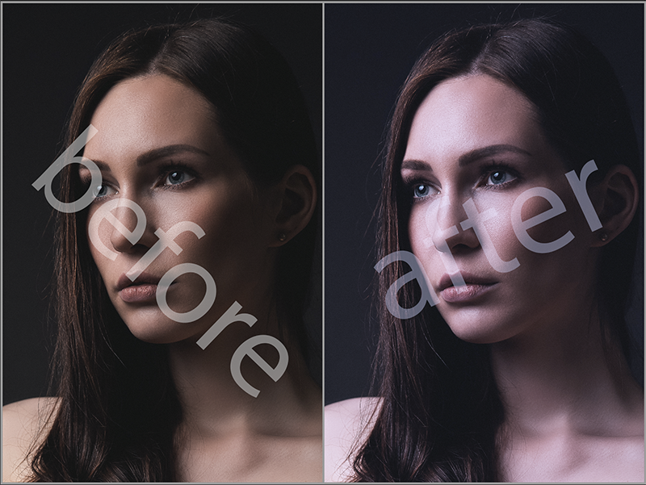
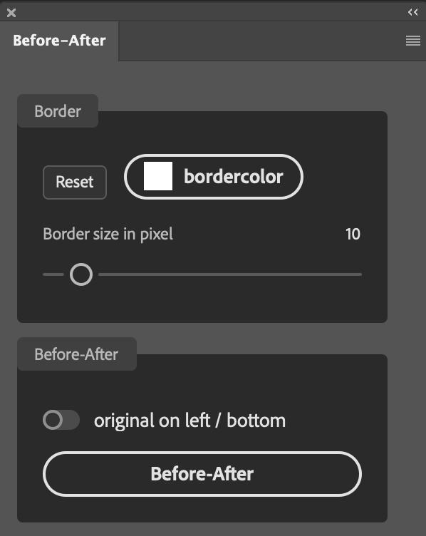

# Before-After Photoshop Plugin (Vanilla)

This plugin create a new document where the before and after layer will be placed on ony layer side by side.

## Loading in Photoshop

You can load this plugin directly in Photoshop by using the UXP Developer Tools application. Once started, click "Add Plugin...", and navigate to the "manifest.json" file in this folder. Then click the ••• button next to the corresponding entry in the developer tools and click "Load". Switch over to Photoshop, and the plugin's panel will be running.

To install the plugin double-click the *.ccx file and follow the instructions.
